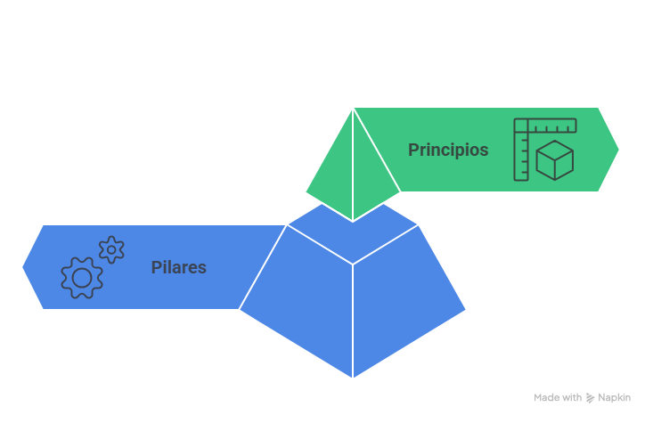

# SOLID-principles

Los principios SOLID son cinco reglas **para escribir código limpio y bien estructurado** enfocado en la programación orientada a objetos. 
Su objetivo es hacer que el software sea más fácil de entender, mantener y escalar. 

```
💬 En pocas palabras:
 SOLID te ayuda a escribir código que no se rompa fácilmente y que sea más fácil de entender y modificar
```

Cada una de las letras hace referencia a un principio 1.`S` 2.`O` 3.`L` 4.`I` 5.`D`

  >_*aclaración🙋‍♀️:aunque se crearon pensando en la programación orientada a objetos también es posible aplicarlos en otros paradigmas como el funcional._

Pero antes de todo preguntémonos… **¿qué es la Programación Orientada a Objetos?**
```
La Programación Orientada a Objetos (POO) es una forma de escribir programas que se basa en organizar el código en objetos.
```

Muy bien y...**¿Cómo organizo mi código con POO?** 👉 con clases.

Cuando empiezo a escribir mi código, lo organizo a través de clases. Estas clases son como moldes que me permiten crear objetos y definir las acciones que pueden hacer (eso que llamamos métodos).

Este es el nivel más básico👶:

>👶Tengo clases,

>👶Las clases pueden crear objetos,

>👶Y esos objetos pueden hacer cosas.


Ahora bien… ¿qué pasa cuando tengo más de una clase? **¿Y si tengo muchas acciones, muchas responsabilidades?** 

A medida que mi código crece, el programa se vuelve más complejo. Por eso es tan importante tener un criterio claro para organizarlo bien:

¿Qué tan grande debe ser una clase? ¿Cuántas cosas debería hacer?¿Cómo deberían interactuar entre ellas?

Como esto es algo que muchas personas del mundo del desarrollo enfrentan, se definieron principios a seguir para ayudar a tomar buenas decisiones.
````
💡Personas viendo problemas y buscando soluciones💡
````

Así nacieron los principios de la programación orientada a objetos: los principios SOLID.

> 🔴✋ _Ojo: no hay que confundirlos con los PILARES de la programación orientada a objetos (abstracción, encapsulamiento, herencia y polimorfismo), que son los conceptos base de cómo funciona este paradigma._
<br/>

`IMPORTANTE`👇
---

---
`PILARES VS PRINCIPIOS`
>Los pilares son el **"cómo funciona la POO"**
>
>SOLID es el **"cómo escribir buen código con POO".**
---
  

`Comenzamos con los principios SOLID`
---

## **`S`** - **Principio de Responsabilidad Única**.

 
¿Qué significa que una clase tenga una “responsabilidad única”?

Significa que una clase debe encargarse de una sola cosa.En otras palabras: una clase debe tener un solo motivo para cambiar.
Ejemplo en la vida real: en una orquesta cada músico toca un solo instrumento no varios, es su única responsabilidad.
Ejemplo sobre el code: Vamos hacer nuestra clase Libro para nuestra app de libros

Si mi app es de libros, la clase libros tendrá mucha responsabilidad, como organizo mi code?
Si yo no supiera de los principios SOLID podría acabar haciendo algo como esto:

  
`❌Atención❌: Ejemplo SIN ❌ la S de solid, a continuación vamos a ver una clase que tiene demasiadas responsabilidades`   

  ```ts
class Book {
  title: string;
  author: string;

    constructor(title: string, author: string) {
      this.title = title;
      this.author = author;
    }
  
    displayInfo() {
      console.log(`${this.title} - ${this.author}`);
    }
  
    saveToDatabase() {
      // logic to save the book to a database
    }
  
    exportAsPDF() {
      // logic to export the book as a PDF
    }
}

```

¿Qué problema vemos aquí?
La clase Libro está haciendo más de una cosa: tiene demasiadas responsabilidades


> 1️⃣Representa los datos del libro + 2️⃣Muestra información en consola  + 3️⃣Guarda en la base de datos + 4️⃣Exporta como PDF 

Si mañana cambiamos la forma de guardar libros, esta clase cambiaría. Si mañana cambiamos el formato del PDF, también cambiaría.
Demasiados motivos para cambiar...no estamos siguiendo el primer principio y eso a lar larga nos traerá problemas.

**¿Cómo lo solucionamos? Separando las responsabilidades** en clases distintas, es decir, siguiendo el primer principio.

 ` ✅Atención ✅: Ejemplo ✅ CON la S de solid, a continuación vamos a ver clases con una única responsabilidad`   

  
 ```ts
class Book {
  title: string;
  author: string;

    constructor(title: string, author: string) {
      this.title = title;
      this.author = author;
    }
  }
  
  class BookPrinter {
    displayInfo(book: Book) {
      console.log(`${book.title} - ${book.author}`);
    }
  }
  
  class BookService {
    save(book: Book) {
      // logic to save to the database
    }
  }
  
  class BookPDFExporter {
    export(book: Book) {
      // logic to export as PDF
    }
  }

  ```

Este code en un repositorio lo encontrarías ordenado por carpetas

la clase Book: 📁 models/Book.ts

la clase BookServices 📁 services/BookService.ts

la clase BookPrinter 📁 utils/BookPrinter.ts


## **`O`** - **Principio de Abierto/Cerrado**.
Abierto para extensión, cerrado para modificación
¿Qué significa esto? Significa que tu código debería poder extenderse sin necesidad de modificar el existente.
Es decir: si mañana necesitás nuevas funcionalidades, deberías poder agregarlas sin tener que romper o reescribir lo que ya funciona.
Sobre el ejemplo anterior de nuestro api de libros: ¿Qué pasa si mañana quiero exportar los libros no solo como PDF sino también como HTML o EPUB?

`❌Atención❌: Ejemplo SIN ❌ la O de solid` 
```ts
class BookExporter {
  export(book: Book, format: string) {
    if (format === "pdf") {
      // lógica PDF
    } else if (format === "html") {
      // lógica HTML
    } else if (format === "epub") {
      // lógica EPUB
    }
  }
}

```

**¿Cuál es el problema?**
Cada vez que agrego un nuevo formato, tengo que modificar la clase. Si hay un error, puede afectar todos los formatos. Se vuelve difícil de mantener.

Nos saltamos el principio Open/Closed.
` ✅Atención ✅: Ejemplo ✅ CON la O de solid`
La idea es usar uno de los pilares de la programación para solucionar esto: el polimorfismo (o composición) para extender sin modificar.

`📁 interfaces/Exporter.ts`

En el ejemplo de los exportadores de libros, vamos a utilizar una interface para permitir que nuestro sistema acepte distintos tipos de exportadores sin tener que modificar el código existente.
```ts
import { Book } from "../models/Book";

export interface Exporter {
  export(book: Book): void;
}

```

`📁 exporters/BookPDFExporter.ts`

La palabra clave implements se usa cuando una clase quiere seguir un contrato definido por una interface.
`implements` significa: “Esta clase promete tener todo lo que dice esta interface.
```ts
import { Book } from "../models/Book";
import { Exporter } from "../interfaces/Exporter";

export class BookPDFExporter implements Exporter {
  export(book: Book) {
    console.log(`Exporting "${book.title}" as PDF...`);
  }
}

```

a estas alturas es posible que te estes preguntando ¿ cuales es la diferencia entre extends e implements?
| Característica                  | `extends`                          | `implements`                              |
|-------------------------------|------------------------------------|-------------------------------------------|
| ¿Qué hace?                    | Hereda de otra clase               | Implementa una interface                  |
| ¿Hereda comportamiento?      | Sí, hereda métodos y propiedades   | No, solo obliga a tener ciertos métodos   |
| ¿Qué hereda?                 | Código real (métodos, lógica)      | Solo la forma o estructura (firma)        |
| ¿Puede usar múltiples?       | ❌ Solo una clase                  | ✅ Puede implementar múltiples interfaces |
| ¿Para qué se usa?            | Reutilizar lógica y comportamiento | Garantizar estructura o contrato          |
| ¿Con qué se usa?             | Con clases                         | Con interfaces                             |
| Ejemplo                      | `class Dog extends Animal {}`      | `class Fish implements Swimmer {}`        |

`extends` → “Copiame todo lo que tienes, quiero ser como tu (y modificarte un poco).”

`implements` → “No me des tu código, solo deme qué necesito tener para ser compatible.”

En este ejemplo la interface es el "pegamento" que conecta todo y hace que tenga esa base comun sobre la que abrir nuevas responsabilidades.

`📁 exporters/BookHTMLExporter.ts`
```ts
import { Book } from "../models/Book";
import { Exporter } from "../interfaces/Exporter";

export class BookHTMLExporter implements Exporter {
  export(book: Book) {
    console.log(`Exporting "${book.title}" as HTML...`);
  }
}

```

`📁 controllers/BookController.ts`
```ts
import { Book } from "../models/Book";
import { BookPDFExporter } from "../exporters/BookPDFExporter";
import { BookHTMLExporter } from "../exporters/BookHTMLExporter";

const book = new Book("Clean Code", "Robert C. Martin");

const exporterPDF = new BookPDFExporter();
exporterPDF.export(book);

const exporterHTML = new BookHTMLExporter();
exporterHTML.export(book);

```
¿Qué logramos?
Las clases están cerradas para modificación 

Puedes agregar BookEPUBExporter, BookMarkdownExporter, etc., sin tocar las anteriores 

El código es más flexible, escalable y modular.
En la práctica, el principio Open/Closed nos lleva a crear muchas clases adicionales, pero todas esas clases comunican la misma idea a través de una interface. La magia de este enfoque está en no modificar el código que ya existe, sino extenderlo mediante la creación de nuevas clases que implementan una interface común.
Si no seguimos este principio, cada vez que querés agregar un nuevo tipo de exportador, tendrías que modificar la lógica de exportBook(). Eso trae varios problemas:

Rompe código existente.

Hace el código más propenso a errores (porque algo ya escrito podría dejar de funcionar con el cambio).

Hace más difícil de mantener.

## **`L`** - **Principio de Sustitución de Liskov** 

¿Qué significa que una subclase pueda sustituir a su clase base sin alterar el comportamiento esperado?

El **Principio de Sustitución de Liskov (LSP)** nos dice que las subclases deben ser completamente intercambiables por sus clases base sin que se rompa la funcionalidad del sistema. En otras palabras, si una clase base define un comportamiento, **la subclase debe ser capaz de cumplir con las mismas expectativas sin modificar ese comportamiento**.

Ejemplo en la vida real: Imagina que estás en una tienda y pides una camisa de una talla específica. La tienda debería poder ofrecerte la talla sin modificar sus condiciones. Si la tienda te da algo diferente, como una chaqueta en lugar de una camisa, no estarías recibiendo lo esperado.

Ejemplo sobre el código: Siguiendo con nuestra aplicación de libros, supongamos que tenemos una clase base `Book` y creamos una subclase `Ebook`. El principio de Liskov nos asegura que si utilizamos `Ebook` en lugar de `Book`, todo debe seguir funcionando sin sorpresas. Si una subclase modifica la forma en que funciona un método, estamos violando el LSP.

### **¿Cómo podría ser un mal ejemplo? (Sin LSP)**

En este caso, si modificamos el comportamiento de `Book` en `Ebook`, podríamos crear un código que no cumpla con las expectativas del sistema.

```ts
class Book {
  constructor(public title: string, public author: string) {}

  displayInfo() {
    console.log(`${this.title} by ${this.author}`);
  }
}

class Ebook extends Book {
  constructor(title: string, author: string, public fileSize: number) {
    super(title, author);
  }

  // La subclase altera el comportamiento de la clase base
  displayInfo() {
    console.log(`Ebook: ${this.title} by ${this.author}, file size: ${this.fileSize}MB`);
  }
}

function printBookInfo(book: Book) {
  book.displayInfo();
}

const myBook = new Book("Clean Code", "Robert C. Martin");
const myEbook = new Ebook("Clean Code", "Robert C. Martin", 2);

printBookInfo(myBook);   // Expected output: "Clean Code by Robert C. Martin"
printBookInfo(myEbook);  // Expected output: "Ebook: Clean Code by Robert C. Martin, file size: 2MB"
```

### **¿Cuál es el problema aquí?**

- **`Ebook` cambia el comportamiento de `displayInfo()`**, algo que no esperamos en la subclase. Esto hace que el código que esperaba un `Book` normal podría no funcionar correctamente con un `Ebook`.
- La función `printBookInfo()` que espera un `Book`, cuando le pasamos un `Ebook`, tiene un comportamiento inesperado debido a la modificación de la subclase.

Esto se salta el principio de **Sustitución de Liskov**, ya que la subclase no se comporta como la clase base.

---

### **¿Cómo podemos corregir esto y aplicar LSP correctamente?**

Para seguir el principio de Liskov, **las subclases deben extender las funcionalidades de la clase base sin modificar su comportamiento**. Esto significa que `Ebook` debe **respetar la lógica de `displayInfo()`**, pero podemos añadirle más características sin alterar el comportamiento original.

### **Solución respetando LSP**

```ts
class Book {
  constructor(public title: string, public author: string) {}

  displayInfo() {
    console.log(`${this.title} by ${this.author}`);
  }
}

class Ebook extends Book {
  constructor(title: string, author: string, public fileSize: number) {
    super(title, author);
  }

  // La subclase ahora respeta el comportamiento de la clase base
  displayInfo() {
    super.displayInfo();  // Llamamos a la versión base
    console.log(`File size: ${this.fileSize}MB`);
  }
}

function printBookInfo(book: Book) {
  book.displayInfo();
}

const myBook = new Book("Clean Code", "Robert C. Martin");
const myEbook = new Ebook("Clean Code", "Robert C. Martin", 2);

printBookInfo(myBook);   // Expected output: "Clean Code by Robert C. Martin"
printBookInfo(myEbook);  // Expected output: "Clean Code by Robert C. Martin" and "File size: 2MB"
```

### **¿Qué logramos con esta corrección?**

- **`Ebook` ahora extiende** el comportamiento de `Book` sin modificar la funcionalidad original de `displayInfo()`.
- **La clase base `Book`** se comporta como se espera, incluso si es reemplazada por una subclase `Ebook`.
- El código sigue funcionando como se esperaba en la función `printBookInfo()` sin romper nada.

---

- ** Liskov** nos asegura que las subclases pueden ser utilizadas en lugar de la clase base sin alterar el comportamiento del programa.
- Las subclases **no deben cambiar la lógica** de los métodos heredados, sino que deben **extenderlos** de manera que el código base siga funcionando correctamente.
- **Aplicar LSP** nos permite mantener un código **más predecible** y **evitar sorpresas** al usar subclases en el lugar de clases base, lo que mejora la **flexibilidad** y **escalabilidad** del sistema.

Este principio nos da una base sólida para extender nuestras clases sin tener que preocuparnos de que se rompa el sistema cuando cambiamos la implementación de una clase base.

¿choca esto con el pilar del polimorfismo?
El polimorfismo permite que las subclases sobrescriban métodos, pero el principio de Liskov establece que cualquier método heredado que sea sobrescrito no debe modificar las expectativas del sistema. Esto significa que si un método es sobrescrito en una subclase, debe mantener el mismo comportamiento que se espera de la clase base, sin cambiar su firma ni sus expectativas.

Por lo tanto, no hay un conflicto entre el polimorfismo y el principio de Liskov si las subclases sobrescriben los métodos de manera correcta, respetando las expectativas de la clase base.


